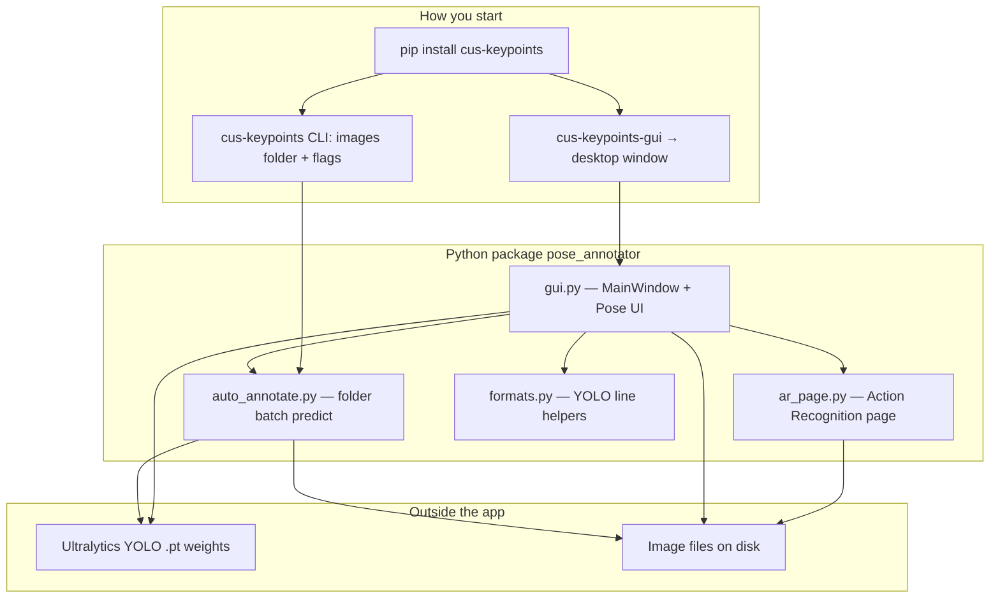
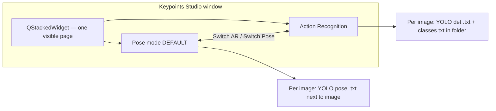
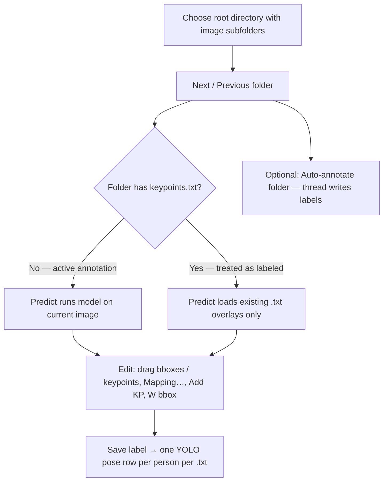
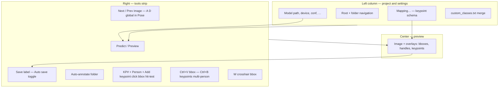
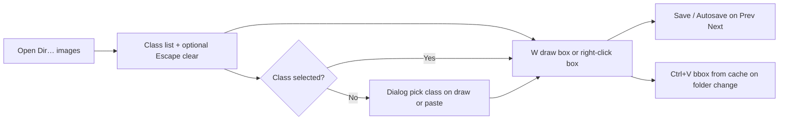
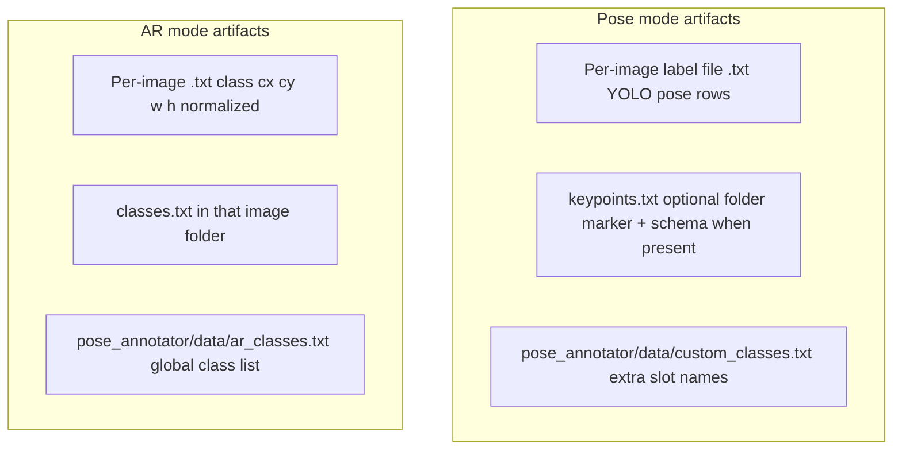

# Keypoints Studio

**Keypoints Studio** is a desktop tool for building **YOLO-style datasets**: **pose / keypoint** labels with Ultralytics models, plus an optional **Action Recognition** screen for simple **bounding-box + class** labels (similar in spirit to [labelImg](https://github.com/HumanSignal/labelImg)).

---

## What you can do

| Mode | Purpose |
|------|---------|
| **Pose (default)** | Auto-annotate or manually edit **bounding boxes + keypoints**, custom keypoint slots, save **YOLO pose** `.txt` next to each image. |
| **Action Recognition** | Click **Switch AR** — draw **rectangles**, pick a **class**, save **YOLO detection** `.txt` (`class cx cy w h`). |

---

## System map (grand chart)

Use this section as a **single-page mental model** of the app. (GitHub renders the diagrams below; if you read this elsewhere, use a Mermaid-capable viewer.)

### 1. Big picture — how you run it and what it talks to



### 2. Desktop GUI — two modes in one window



### 3. Pose mode — user journey (happy path)



### 4. Pose mode — tools and shortcuts (what touches what)



### 5. Action Recognition mode — compact flow



### 6. Label files on disk (both modes)



### 7. CLI vs GUI (who writes where)

| Path | Role |
|------|------|
| **`cus-keypoints-gui`** | Interactive Pose + AR; Pose saves **`.txt` next to each image**; settings in the window. |
| **`cus-keypoints` CLI** | Batch pose inference via `auto_annotate.py`; default output is a **separate labels tree** (see CLI `--labels-dir`), unless your build uses “same folder” flags. |

---

## Quick start

1. Create conda env and install PyTorch (GPU optional) — see [Install](#install).
2. Install from PyPI: `python -m pip install cus-keypoints` — or from source: `python -m pip install -e .`
3. Launch: `cus-keypoints-gui`
4. **Pose workflow:** pick a **root directory** → app lists **subfolders that contain images** → use **Next folder** / **Previous folder** → **Predict / Preview** or **Auto-annotate folder** → edit → **Save label**.
5. **AR workflow:** **Switch AR** → **Open Dir…** → select class → **Create Box (W)** and drag → **Save**.

---

## Screenshots

Add PNGs under `images/` in the repo to show them on GitHub:

| Preview | File |
|--------|------|
| Main GUI | `./images/GUI.png` |
| Keypoint mapping | `./images/custom_keypoints.png` |


If images do not appear, check that the paths and filenames match exactly.

---

## Requirements

- **Windows** 10/11 (other OS may work; scripts below target Windows paths.)
- **Python** 3.10+ (example uses 3.10)
- **Anaconda or Miniconda** (recommended)
- **NVIDIA GPU + CUDA PyTorch** optional — CPU works, slower

---

## Install

### 1. Conda environment

```bat
conda create -n torch_gpu python=3.10 -y
conda activate torch_gpu
```

### 2. PyTorch with CUDA (optional)

```bat
conda activate torch_gpu
conda install -y pytorch torchvision torchaudio pytorch-cuda=12.1 -c pytorch -c nvidia
```

Check GPU:

```bat
python -c "import torch; print('torch', torch.__version__); print('cuda', torch.cuda.is_available()); print('gpus', torch.cuda.device_count())"
```

### 3. Install Keypoints Studio

**PyPI (recommended once published):**

```bat
conda activate torch_gpu
python -m pip install -U pip
python -m pip install cus-keypoints
```

**Editable install from a git clone** (folder that contains `pyproject.toml`):

```bat
conda activate torch_gpu
cd /d "C:\path\to\cus_keypoints"
python -m pip install -U pip
python -m pip install -e .
```

---

## Run the GUI

```bat
conda activate torch_gpu
cus-keypoints-gui
```

Console command names are **`cus-keypoints`** (CLI) and **`cus-keypoints-gui`** (GUI). The Python package you import is still **`pose_annotator`**.

---

## Pose mode — guide

### Project panel

- **Switch AR** — opens Action Recognition mode (bbox + class only).
- **Root directory** — choose a folder that **contains multiple image subfolders**. The app scans **immediate child folders** that have at least one image, opens the **first** folder, and shows **Folders: i/total**.
- **Previous folder / Next folder** — switch the active annotation folder.
- **Recursive** — when scanning subfolders for images, include nested images (same flag affects listing inside each folder).

### After moving to the next folder

If the **current folder** already contains **`keypoints.txt`** (treated as finished), the whole folder is moved under:

`<Root>/Annotation_Done/<folder_name>/`

(`Annotation_Done` is created if needed.)

### Preview & tools

| Action | How |
|--------|-----|
| Zoom | Mouse wheel |
| Pan | Drag (or middle-drag in some modes) |
| Next / previous image | Buttons **Next** / **Previous**, or keys **D** / **A** (global shortcuts in Pose mode) |
| Run model | **Predict / Preview** (uses CUDA if available, else CPU) |
| Save current frame | **Save label** |
| Auto-save on image change | Enable **Auto save**, then use **Next** / **Previous** or **A** / **D** |
| Paste bbox from **previous** image only | Focus preview, **Ctrl+V** — replaces bbox for selected **Person**; keypoints unchanged |
| Paste keypoints from **previous** frame | Focus preview, **Ctrl+B** — pastes **all** copied persons onto **Person** *N*, *N+1*, … (set **Person** to the first target). Cached when you **Prev/Next** image. |
| Crosshair + draw new bbox | **W** — crosshair; drag left button; middle-drag pans |
| **Add keypoint** | Toggle **Add keypoint**, pick **KP#**, then click: the person is **whichever bbox contains the click** (if several overlap, nearest box center). Clicks **outside** all boxes use **Person** spinbox. |
| Delete keypoint / bbox | Select item, **Delete**, or right-click menu |

### Labeled folder behavior

If a folder contains **`keypoints.txt`**:

- **Auto-annotate folder** is **disabled** for that folder.
- **Predict / Preview** **does not** run the model; it loads **`image.txt`** next to each image and shows overlays.

### Config files (Pose)

| File | Role |
|------|------|
| `pose_annotator/data/custom_classes.txt` | Optional extra **custom keypoint slots** (`7. Trachea`). Shipped with the package (under `site-packages/.../pose_annotator/data/` after `pip install`). Loaded at startup; merged into the mapping preview (header shown in red). |

The repository root `data/` folder is only a convenience copy for browsing on GitHub — the running app reads **`pose_annotator/data/`**.

### Keypoint mapping

Use **Mapping…** to reorder YOLO keypoints, add/remove custom slots, and rename outputs. The summary under **Keypoint mapping** reflects the active schema.

---

## Action Recognition mode (**Switch AR**)

Inspired by workflows like [labelImg](https://github.com/HumanSignal/labelImg): rectangles + classes, no keypoints.

| Item | Detail |
|------|--------|
| Enter / exit | **Switch AR** (Pose screen) / **Switch Pose** (AR screen) |
| Classes | `pose_annotator/data/ar_classes.txt` — **one class per line**; class **ID = line index starting at 0** |
| Labels | One `<image>.txt` per image: `class_id x_center y_center width height` (normalized 0–1) |
| Also writes | `classes.txt` in that image folder (class names) |
| Useful keys | **W** toggle draw box, **A** / **D** prev/next image, **Ctrl+S** save, **Del** delete selected box |

---

## Label formats

### YOLO pose (Pose mode)

One row per person:

```text
class_id x_center y_center width height x1 y1 v1 ... xK yK vK
```

- Coordinates normalized to `[0, 1]`.
- `v`: typically `0` (missing) or `2` (visible); custom schemas may use more than 17 keypoints.

Docs: [Ultralytics pose dataset format](https://docs.ultralytics.com/datasets/pose/)

### YOLO detection (AR mode)

One row per box:

```text
class_id x_center y_center width height
```

---

## CLI (batch pose auto-annotate)

```bat
conda activate torch_gpu
cus-keypoints "C:\path\to\images" --device 0 -v
```

- **`--device cpu`** forces CPU.
- CLI writes labels to a **labels directory** (see `--labels-dir` / defaults). The **GUI** saves **`*.txt` next to each image**.

---

## Troubleshooting

### CUDA missing or `Invalid CUDA device`

```bat
python -c "import torch; print(torch.__version__, torch.cuda.is_available())"
```

Reinstall CUDA builds from conda (see [Install](#install)), or use **`cpu`** in the GUI device field.

### `WinError 32` when reinstalling (executable locked)

Close **cus-keypoints-gui**, then:

```bat
python -m pip install -e .
```

### GitHub rejects large `.pt` files

Do **not** commit model weights. Keep them local and use `.gitignore` patterns such as `*.pt`.

---

## Maintainer: publish to PyPI

Distribution name on PyPI: **`cus-keypoints`** (the unrelated PyPI project **`pose-annotator`** is a different tool).

1. Bump **`__version__`** in `pose_annotator/__init__.py`.
2. Build and upload:

```bat
python -m pip install -U build twine
python -m build
python -m twine upload dist/*
```

Use a [PyPI API token](https://pypi.org/help/#apitoken) as the password. Prefer [trusted publishing](https://docs.pypi.org/trusted-publishers/) from GitHub Actions if you use CI.

---

## License

Released under the MIT License — see [`LICENSE`](LICENSE).
